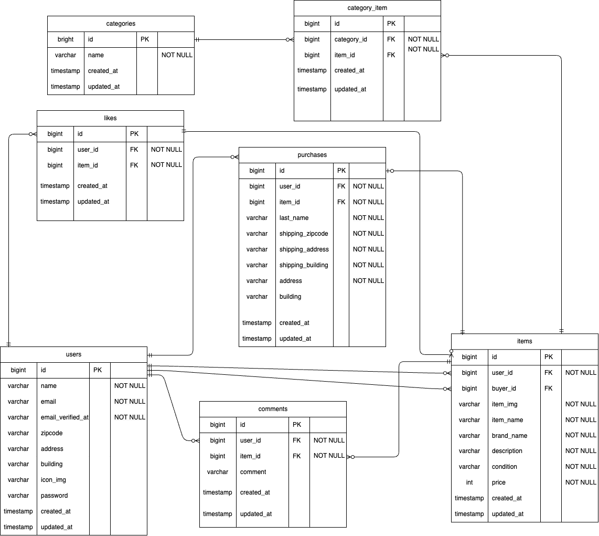

# フリマアプリ

## 環境構築

### Dockerビルド

* git clone
* docker-compose up -d --build

### Laravel 環境構築

* docker-compose exec php bash
* composer install
* cp .env.example .env, 環境変数を適宜変更
* php artisan key:generate
* php artisan migrate
* php artisan db:seed

### 開発環境

* 商品一覧画面(トップ画面)：http://localhost
* 商品一覧画面(トップ画面)_マイリスト：http://localhost/?tab=mylist
* 会員登録画面：http://localhost/register
* ログイン画面：http://localhost/login
* 商品詳細画面：http://localhost/item/{item_id}
* 商品購入画面：http://localhost/purchase/{item_id}
* 住所変更ページ：http://localhost/purchase/address/{item_id}
* 商品出品画面：http://localhost/sell
* プロフィール画面：http://localhost/mypage
* プロフィール編集画面：http://localhost/mypage/profile
* プロフィール画面_購入した商品一覧：http://localhost/mypage?page=buy
* プロフィール画面_出品した商品一覧：http://localhost/mypage?page=sell
* Phpmyadmin：http://localhost:8080
* Mailhog：http://localhost:8025

## 使用技術(実行環境)

* nginx 1.21.1
* PHP 8.1-fpm
* MYSQL 8.0.26
* Laravel 8.83.8
* mailbag 1.0.1

## ER図

